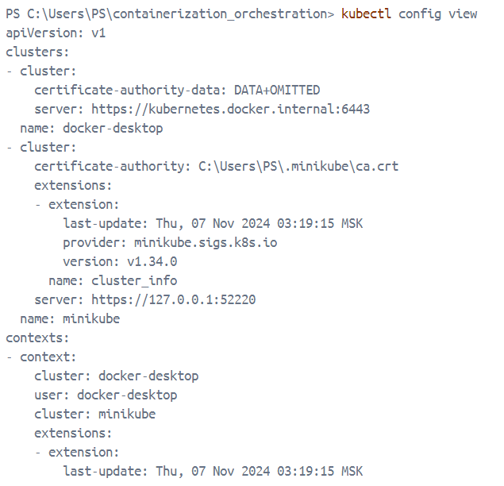
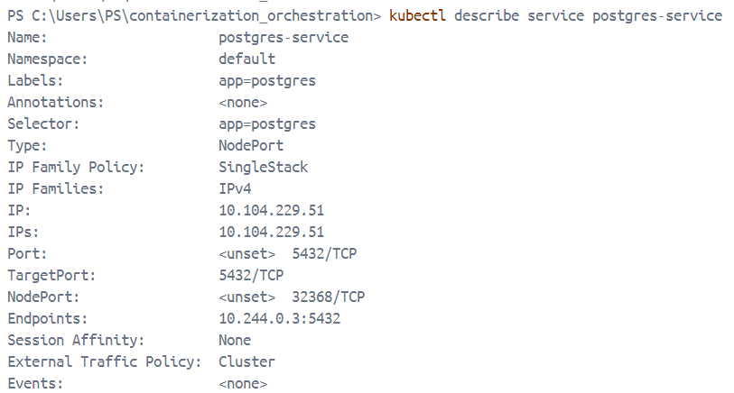
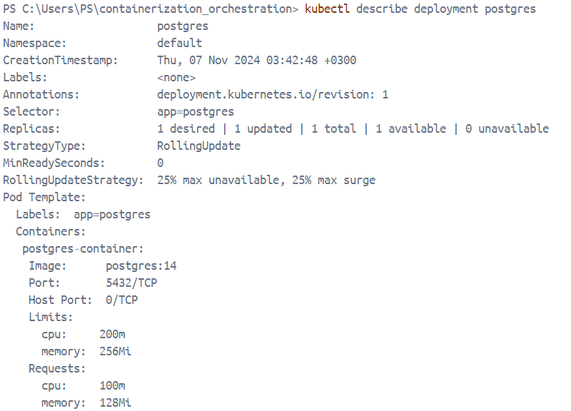
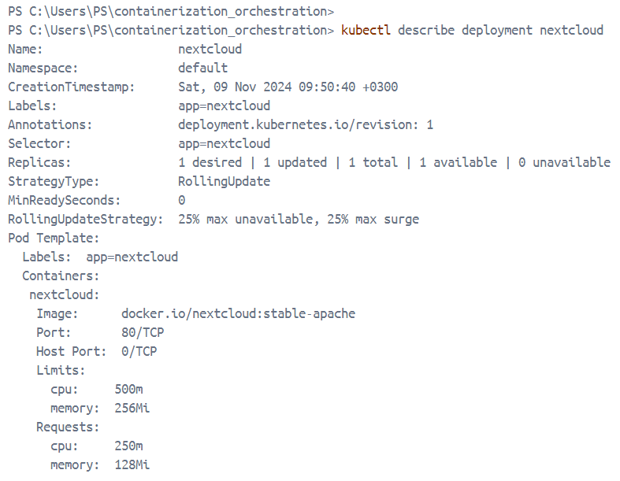
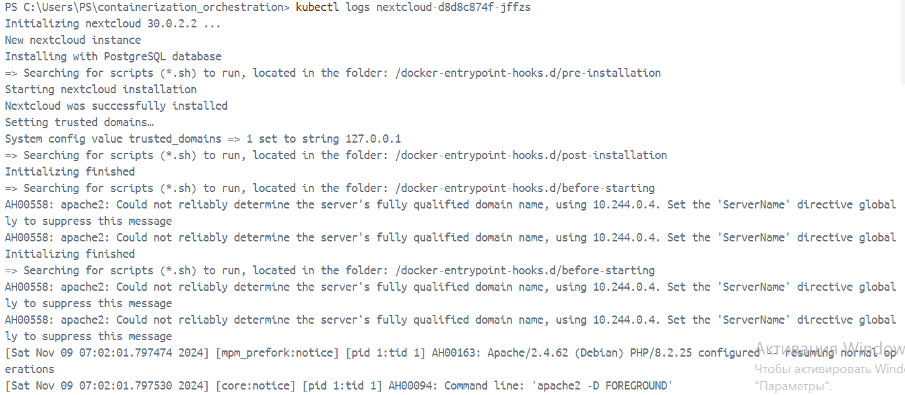
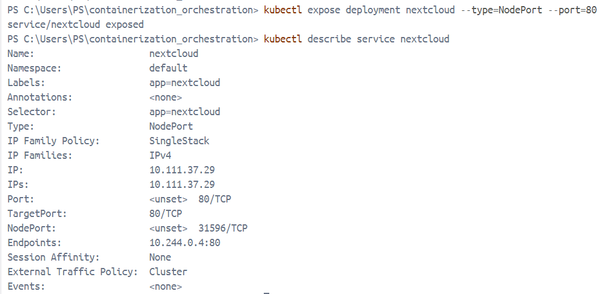
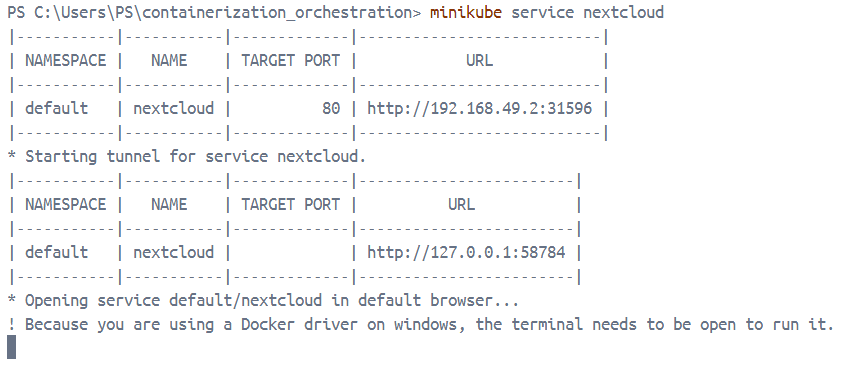
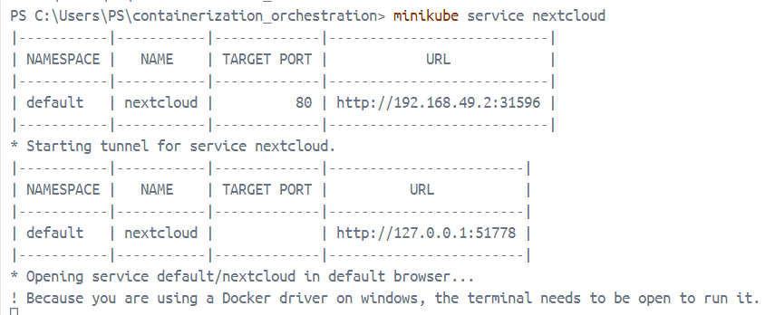
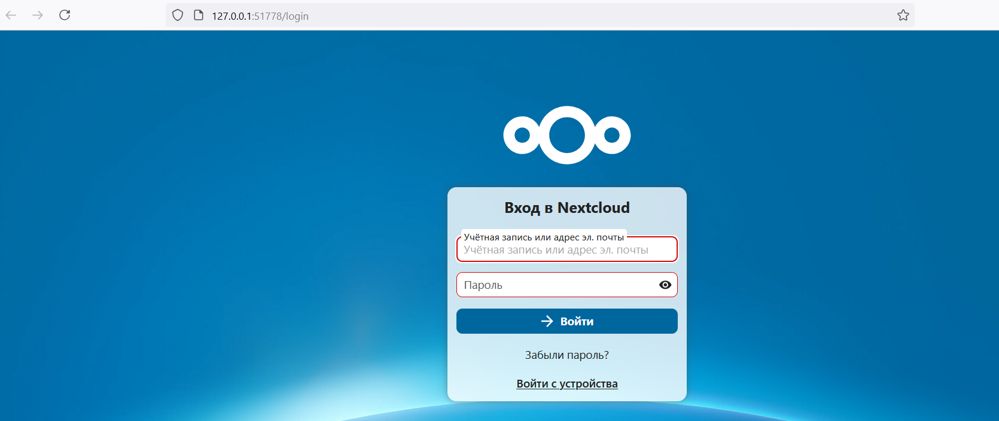

## containerization_orchestration

### Project Overview

This repository contains laboratory works related to containerization and orchestration, each in a separate branch.

### Branches:

- **Lab 1**: `lab1` [branch lab1 ](https://github.com/alexiv-tn65/containerization_orchestration/tree/lab1)
- **Lab 2**: `lab2` [branch lab2 ](https://github.com/alexiv-tn65/containerization_orchestration/tree/lab2)
- **Lab 3**: `lab3` [branch lab3 ](https://github.com/alexiv-tn65/containerization_orchestration/tree/lab3)
- **Lab 4**: `lab4` [branch lab4 ](https://github.com/alexiv-tn65/containerization_orchestration/tree/lab4)

#### Ход выполнения 

Проверить, что все успешно установилось:

kubectl config view (должен отобразиться конфиг созданного кластера):

Проверить, что все ресурсы успешно создались:

Посмотреть конкретный ресурс:

Для  nextcloud:

Проверка:

Экземпляр Nextcloud был успешно установлен:

kubectl expose deployment nextcloud --type=NodePort --port=80

Туннелирование трафика между нодой minikube и Сервисом с помощью команды:  
minikube service nextcloud

Получить доступ к  приложению Nextcloud:   
minikube service nextcloud --url   
http://127.0.0.1:59549

Установка Dashboard     
minikube dashboard --url

#### Вопрос: важен ли порядок выполнения этих манифестов? Почему?

Да, порядок выполнения манифестов важен по следующим причинам:

- **Зависимости**: 
  - `ConfigMap` (`pg_configmap.yml`) должен быть создан первым, так как он содержит конфигурационные данные для deployment PostgreSQL. Если `pg_deployment.yml` будет создан до этого, deployment не найдет необходимые переменные окружения.

- **Сервисы**: 
  - Сервис (`pg_service.yml`) следует создавать после `ConfigMap` и перед deployment, чтобы обеспечить доступ к подам PostgreSQL.

- **Рекомендуемый порядок**:
  - Сначала создайть `ConfigMap`, затем service, а затем deployment.

#### Вопрос: что (и почему) произойдет, если отскейлить количество реплик postgres-deployment в 0, затем обратно в 1, после чего попробовать снова зайти на Nextcloud?

Снижение количества реплик до 0:   
kubectl scale deployment postgres-deployment --replicas=0    

Возвращение количества реплик обратно на 1:           
kubectl scale deployment postgres-deployment --replicas=1

Посмотреть логи    
kubectl logs nextcloud-d8d8c874f-jffzs

Если  отскейлить количество реплик postgres-deployment до 0 то:    
сначала  PostgreSQL будет остановлен, и Nextcloud не сможет подключиться к базе данных.  
Когда вернуть количество реплик обратно на 1, Kubernetes создаст новый под с экземпляром PostgreSQL.   
После того как новый под будет запущен и готов к работе, база данных снова станет доступной.  
После этого Nextcloud снова сможет подключаться к базе данных.   
Но видимо Nextcloud не пытается заново подключиться базе, поэтому он не будет корректно работать.

Если удалить под Nextcloud:    
kubectl delete pod nextcloud-d8d8c874f-jffzs     
Это приведет к тому, что Kubernetes автоматически создаст новый под Nextcloud: 

В моем случае по адресу http://127.0.0.1:51778 cнова можно получить доступ к Nextcloud, который будет работать.    

      

Т.е. вероятно  Nextcloud не пытался подключиться к  БД после того как был создан новый под с экземпляром PostgreSQL, после того как пересоздали под Nextcloud он подключился и все заработало.

